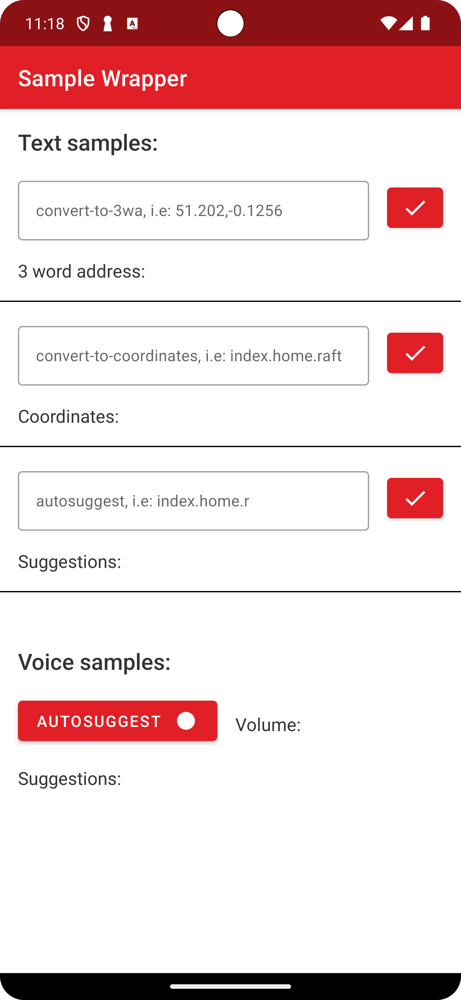
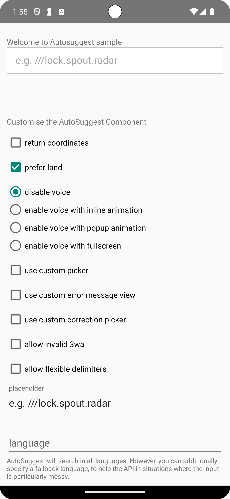
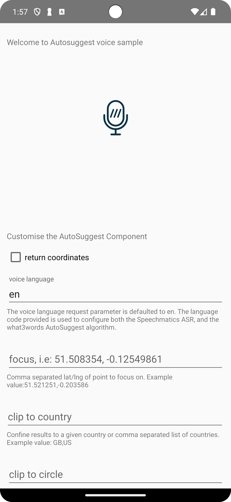
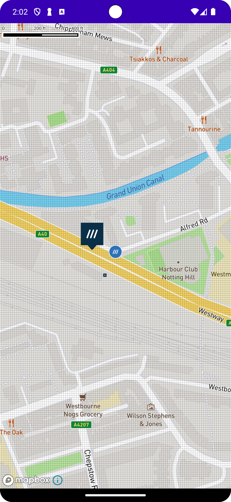
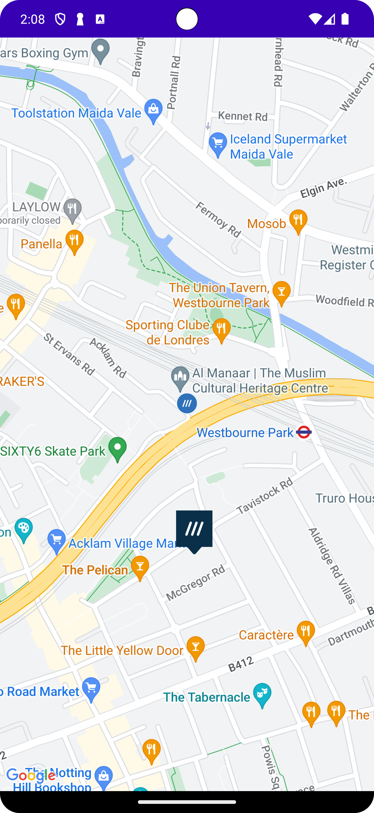
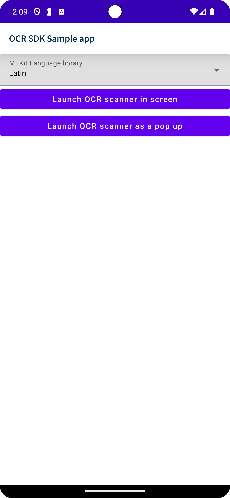

# &nbsp;What3words Library Samples

This repository contains a set of individual Android Studio projects to help you learn about
how to use What3words Library. Each sample demonstrates different use cases, complexity levels and APIs.

For more information, please [read the documentation](https://developer.what3words.com/public-api).
<br><br>
### Gradle Properties

```groovy
MAPBOX_DOWNLOADS_TOKEN = YOUR_MAPBOX_DOWNLOADS_TOKEN
MAPBOX_ACCESS_TOKEN = YOUR_MAPBOX_ACCESS_TOKEN
MAPS_API_KEY = YOUR_GOOGLE_MAP_API_KEY
PROD_API_KEY = YOUR_W3W_PRODUCTION_KEY
```

To obtain an PROD_API_KEY key, please visit https://what3words.com/select-plan and sign up for an account. That used for what3words library.

MAPBOX_DOWNLOADS_TOKEN and MAPBOX_ACCESS_TOKEN for MapBox access. Please follow the quick start tutorial on the Mapbox developer portal here: https://docs.mapbox.com/android/maps/guides/install/

MAPS_API_KEY for GoogleMap access. Please follow the quick start tutorial on the Mapbox developer portal here: https://developers.google.com/maps/documentation/android-sdk/start


## Samples
------------

| Project | |
|:-----|---------|
|  <br><b> API Wrapper Sample </b> <br><br> A sample showing how we using What3Words Android Wrapper library in autosuggest textfield search and voice search. <br><br> • Convert from coordinate to 3 words address<br>• Convert from 3 words to coordinate<br>• Search by 3 words <br>• Voice search 3 words<br><br>The library used: **[w3w-android-wrapper](https://github.com/what3words/w3w-android-wrapper)**<br><br>  **[More information](api-wrapper-sample/)**<br><br> |  |
|  |  |
|  <br><b> AutoSuggest Sample </b> <br><br> A sample showing how we using What3Words Components autosuggest textfield in compose and xml. <br><br> • Using Autosuggestion textfield component in compose/xml<br>• Customize voice search layout<br>• Customize picker, error message view<br>• Config result output by languague, clip to country, etc.. <br>• Config valiation input<br><br>The library used: **[w3w-android-components](https://github.com/what3words/w3w-android-components)**<br><br> **[More information](autosuggest-sample/)**<br><br> |  |
|  |  |
|  <br><b> AutoSuggest Voice Sample </b> <br><br> A sample voice only showing how we using What3Words Components voice and how we customize the voice search. <br><br> • Customize the result output by voice language<br>• Config return result coordinate<br>• Config result output by languague, clip to country, etc..<br><br>The library used: **[w3w-android-components](https://github.com/what3words/w3w-android-components)**, **[w3w-android-wrapper](https://github.com/what3words/w3w-android-wrapper)**<br><br>  **[More information](autosuggest-sample-voice/)**<br><br> |  |
|  |  |
|  <br><b> Mapbox Sample </b> <br><br> This is a sample show how using the what3words Map Component provides a straightforward way to add what3words to a Mapbox map and display features such as the what3words grid and what3words markers with what3words address.<br><br>• Display the what3words grid on the top of the basemap<br> • Display mapbox map with What3Words Map Component <br>• Display what3words markers <br><br>The library used: **[w3w-android-map-components](https://github.com/what3words/w3w-android-map-components)**<br><br>  **[More information](mapbox-sample/)**<br><br> |  |
|  |  |
|  <br><b> Google Map Sample </b> <br><br> This is a sample show how using the what3words Map Component provides a straightforward way to add what3words to a Google Map and display features such as the what3words grid and what3words markers with what3words address.<br><br>• Display the what3words grid on the top of the basemap <br> • Display google map with What3Words Map Component <br>• Display what3words markers <br><br>The library used: **[w3w-android-map-components](https://github.com/what3words/w3w-android-map-components)**<br><br>  **[More information](maps-googlemaps-sample/)**<br><br> |  |
|  |  |
|  <br><b> OCR Sample </b> <br><br> This is a sample show how using the what3words OCR Component to detect 3 words adrress<br><br>• Launch OCR scanner in screen <br>• Launch OCR scanner as pop up<br>• Config language for detection  <br><br>The library used: **[w3w-android-ocr-components](https://github.com/what3words/w3w-android-ocr-components)**<br><br>  **[More information](ocr-sample/)**<br><br> |  |
|  |  |
|  <br><b> Multi Component Sample </b> <br><br>A sample combines fully What3Words components such as autosuggest text filed, voice, map, and OCR scanner to demonstrate full flow how using in the real case by showing feature searching by text field, voice, OCR scan and prepopulate to map.<br><br>• Integrate autosuggest textfiled with voice search <br>• Intergrate map component for GoogleMap and Mapbox<br>• Intergrate the OCR scanner<br><br>The library used:  **[w3w-android-wrapper](https://github.com/what3words/w3w-android-wrapper)**, **[w3w-android-map-components](https://github.com/what3words/w3w-android-map-components)**, **[w3w-android-ocr-components](https://github.com/what3words/w3w-android-ocr-components)**<br><br>  **[More information](multi-component-sample/)**<br><br> |  |
|  |  |


### Full What3words library repositories:

| Name                       | Repository |
|----------------------------|----|
| w3w-android-wrapper        |https://github.com/what3words/w3w-android-wrapper
| w3w-android-components     |https://github.com/what3words/w3w-android-components
| w3w-android-map-components |https://github.com/what3words/w3w-android-map-components
| w3w-android-ocr-components |https://github.com/what3words/w3w-android-ocr-components