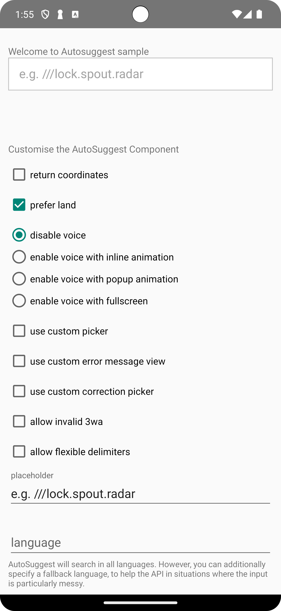

# &nbsp; Auto Suggest Sample 

Autosuggest Sample is a sample demonstration using Android Components API, built with Compose and XML. The goal of the sample is to showcase the current library support.

 For more detailing information about the library please refer the [what3words android components library](https://github.com/what3words/w3w-android-components) repository. 




## Configuration

build.gradle
```gradle
implementation "com.what3words:w3w-android-components:$what3words_android_components_version"
implementation 'androidx.constraintlayout:constraintlayout-compose:<latest-compose-constraintlayout-version>'
implementation 'androidx.compose.ui:ui:<latest-compose-version>'
```

AndroidManifest.xml
```xml
<manifest xmlns:android="http://schemas.android.com/apk/res/android"
    package="com.yourpackage.yourapp">

    <uses-permission android:name="android.permission.INTERNET" />
    ...
```

add this to build.gradle (app level)
```
compileOptions {
    sourceCompatibility JavaVersion.VERSION_1_8
    targetCompatibility JavaVersion.VERSION_1_8
}
```

# Features

## W3WAutoSuggestEditText component

activity_main.xml
```xml
<androidx.constraintlayout.widget.ConstraintLayout
	  xmlns:android="http://schemas.android.com/apk/res/android"
	  xmlns:app="http://schemas.android.com/apk/res-auto"
	  android:layout_width="match_parent"
	  android:layout_height="match_parent">

	 <com.what3words.components.text.W3WAutoSuggestEditText
		  android:id="@+id/suggestionEditText"
		  android:layout_width="0dp"
		  android:layout_height="wrap_content"
		  app:layout_constraintEnd_toEndOf="parent"
		  app:layout_constraintStart_toStartOf="parent"
		  app:layout_constraintTop_toTopOf="parent" />

</androidx.constraintlayout.widget.ConstraintLayout>
```
MainActivity.kt
```Kotlin
class MainActivity : AppCompatActivity() {

    override fun onCreate(savedInstanceState: Bundle?) {
        super.onCreate(savedInstanceState)
        setContentView(R.layout.activity_main)

	suggestionEditText.apiKey("YOUR_API_KEY_HERE")
            .returnCoordinates(false)
            .onSuggestionSelected { suggestion ->
                if (suggestion != null) {
                    Log.i( "MainActivity","words: ${suggestion.words}, country: ${suggestion.country}, distance: ${suggestion.distanceToFocusKm}, near: ${suggestion.nearestPlace}, latitude: ${suggestion.coordinates?.lat}, longitude: ${suggestion.coordinates?.lng}")
                } else {
                    Log.i("MainActivity", "invalid w3w address")
                }
            }
            .onError { error ->
                Log.e("MainActivity", "${error.key} - ${error.message}")
            }
}
```

## Enable voice autosuggest:


The component also allows for voice input using the what3words Voice API. This feature allows the user to say 3 words and using speech recognition technology displays 3 word address suggestions to the user.

Before enabling Voice AutoSuggest you will need to add a Voice API plan in [your account](https://accounts.what3words.com/billing).

By default the voice language is set to English but this can be changed using the voiceLanguage property (for list of available languages please check the properties table below).
Voice input respects the clipping and focus options applied within the general properties. We recommend applying clipping and focus where possible to display as accurate suggestions as possible.
To enable voice you can do with programmatically or directly in the XML.

AndroidManifest.xml
```xml
<manifest xmlns:android="http://schemas.android.com/apk/res/android"
    package="com.yourpackage.yourapp">

    <uses-permission android:name="android.permission.INTERNET" />
    <uses-permission android:name="android.permission.RECORD_AUDIO" />
    ...
```

activity_main.xml
```XML
 <com.what3words.components.text.W3WAutoSuggestEditText
		  android:id="@+id/suggestionEditText"
		  android:layout_width="0dp"
		  android:layout_height="wrap_content"
		  app:layout_constraintEnd_toEndOf="parent"
		  app:layout_constraintStart_toStartOf="parent"
		  app:layout_constraintTop_toTopOf="parent"
		  app:voiceEnabled="true" />
```
or
```Kotlin
 suggestionEditText.apiKey("YOUR_API_KEY_HERE")
	        .returnCoordinates(false)
	        .voiceEnabled(true)
		...
```


## Styles:


We added support for Night mode on version 3.+, if you want to enable Day/Night mode please add the following style to W3WAutoSuggestEditText.
```XML
 <com.what3words.components.text.W3WAutoSuggestEditText
		  android:id="@+id/suggestionEditText"
		  style="@style/Widget.AppCompat.W3WAutoSuggestEditTextDayNight"					
		  android:layout_width="0dp"
		  android:layout_height="wrap_content"
		  app:layout_constraintEnd_toEndOf="parent"
		  app:layout_constraintStart_toStartOf="parent"
		  app:layout_constraintTop_toTopOf="parent" />
```

You can use our base style as parent (Widget.AppCompat.W3WAutoSuggestEditText or Widget.AppCompat.W3WAutoSuggestEditTextDayNight for day/night support) and you can set the custom properties available with XML on the table above and the normal EditText styling, i.e:

```xml
<style name="YourCustomStyle" parent="Widget.AppCompat.W3WAutoSuggestEditText">
    <item name="android:textColor">#000000</item>
    <item name="android:textColorHint">#888888</item>
    <item name="errorMessage">Your custom error message</item>
    <item name="android:hint">Your custom placeholder</item>
    <item name="android:textAppearance">@style/YourCustomStyleTextAppearance</item>
</style>

<style name="YourCustomStyleTextAppearance" parent="TextAppearance.AppCompat">
    <item name="android:textSize">22sp</item>
    <item name="android:fontFamily">sans-serif-medium</item>
</style>
```


