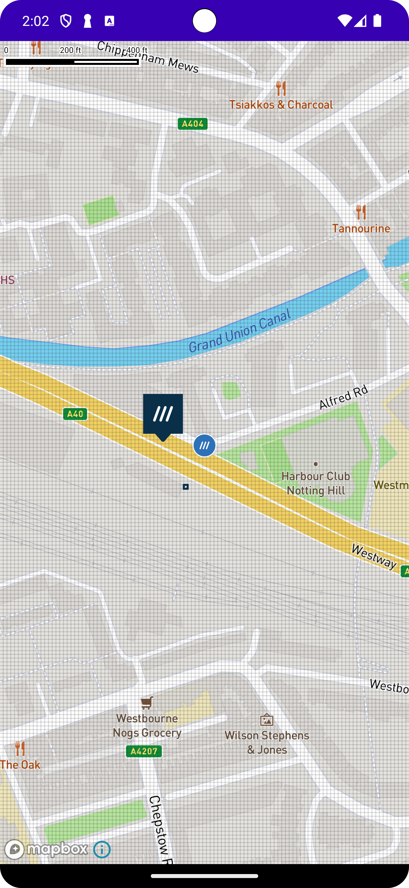

# &nbsp; MapBox Sample 

MapBox Sample is a sample demonstration how using the what3words Map Component provides a straightforward way to add what3words to Mapbox map and display features such as the what3words grid and what3words markers with what3words address.

 For more detailing information about the library please refer the [what3words android map components library](https://github.com/what3words/w3w-android-map-components) repository. 



## Configuration

build.gradle
```gradle
// W3W API Map Lib
implementation "com.what3words:w3w-android-map-components:$what3words_android_map_components_version"
```

AndroidManifest.xml
```xml
<manifest xmlns:android="http://schemas.android.com/apk/res/android"
    package="com.yourpackage.yourapp">

    <uses-permission android:name="android.permission.INTERNET" />
    ...
```

add this to build.gradle (app level)

```
compileOptions {
    sourceCompatibility JavaVersion.VERSION_1_8
    targetCompatibility JavaVersion.VERSION_1_8
}
```

add this the following proguard rules

```
-keep class com.what3words.javawrapper.request.* { *; }
-keep class com.what3words.javawrapper.response.* { *; }
```

# Features

## Enable what3words features in an existing Mapbox maps app using W3WMapBoxWrapper

To use Mapbox Maps on your app, follow the quick start tutorial on the Mapbox developer portal
here: https://docs.mapbox.com/android/navigation/guides/get-started/install/

After a successful Mapbox map run, you can start using our MapboxWrapper following these steps:

activity_main.xml

```xml
<?xml version="1.0" encoding="utf-8"?>
<androidx.constraintlayout.widget.ConstraintLayout
    xmlns:android="http://schemas.android.com/apk/res/android"
    xmlns:app="http://schemas.android.com/apk/res-auto" android:layout_width="match_parent"
    android:layout_height="match_parent">

    <com.mapbox.maps.MapView android:id="@+id/mapView" android:layout_width="0dp"
        android:layout_height="0dp" app:layout_constraintBottom_toBottomOf="parent"
        app:layout_constraintEnd_toEndOf="parent" app:layout_constraintStart_toStartOf="parent"
        app:layout_constraintTop_toTopOf="parent" />

</androidx.constraintlayout.widget.ConstraintLayout>
```

Kotlin

```kotlin
class MainActivity : AppCompatActivity() {
    private lateinit var binding: ActivityMainBinding

    override fun onCreate(savedInstanceState: Bundle?) {
        super.onCreate(savedInstanceState)
        binding = ActivityMainBinding.inflate(layoutInflater)
        binding.mapView.getMapboxMap().loadStyleUri(Style.MAPBOX_STREETS)
        setContentView(binding.root)

        val wrapper = What3WordsV3("YOUR_API_KEY_HERE", this)
        val mapboxWrapper = W3WMapBoxWrapper(
            this,
            binding.mapView.getMapboxMap(),
            wrapper,
        ).setLanguage("en")

        //example how to add a blue marker on a valid 3 word address and move camera to the added marker.
        mapboxWrapper.addMarkerAtWords(
            "filled.count.soap",
            markerColor.BLUE,
            { marker ->

            }, { error ->
                Log.e("MainActivity", "${error.message}")
            }
        )

        //click even on existing w3w added markers on the map.
        mapboxWrapper.onMarkerClicked {
            Log.i("MainActivity", "clicked: ${it.words}")
        }

        //REQUIRED
        binding.mapView.getMapboxMap().addOnMapIdleListener {
            //existing code here...

            //needed to draw the 3x3m grid on the map
            mapboxWrapper.updateMap()
        }

        //REQUIRED
        binding.mapView.getMapboxMap().addOnCameraChangeListener {
            //existing code here...

            //needed to draw the 3x3m grid on the map
            mapboxWrapper.updateMove()
        }

        binding.mapView.getMapboxMap().addOnMapClickListener { latLng ->
            //existing code here...

            //example of how to select a 3x3m w3w square using lat/lng
            mapboxWrapper.selectAtCoordinates(latLng.latitude(), latLng.longitude())
            true
        }
    }
}
```

## Enable what3words features in an new Mapbox maps app using W3WMapboxMapFragment

Since you are creating a new app, you can always opt to use our W3WMapboxMapFragment. The main
advantage is that all the required events to draw the grid are done under the hood, resulting in
less boilerplate code and still having access to the Mapbox Map to apply standard customization (
i.e. map types, etc.)

To use the what3words Mapbox Maps Fragment in your app, first follow the quick start tutorial on the
Mapbox developer portal here: https://docs.mapbox.com/android/navigation/guides/get-started/install/
. This ensures that Mapbox Maps can be used with the what3words Fragment.

After a successful Mapbox map run, you can start using our MapboxWrapper following these steps:

activity_main.xml

```xml
<?xml version="1.0" encoding="utf-8"?>
<fragment xmlns:android="http://schemas.android.com/apk/res/android"
    xmlns:app="http://schemas.android.com/apk/res-auto" android:id="@+id/map"
    android:name="com.what3words.components.maps.views.W3WMapboxMapFragment"
    android:layout_width="match_parent" android:layout_height="match_parent" />
```

Kotlin

```Kotlin
class MainActivity : AppCompatActivity(), W3WMapboxMapFragment.OnMapReadyCallback {

    override fun onCreate(savedInstanceState: Bundle?) {
        super.onCreate(savedInstanceState)
        setContentView(R.layout.activity_main)
        val mapFragment = supportFragmentManager
            .findFragmentById(R.id.map) as W3WMapboxMapFragment
        mapFragment.apiKey("YOUR_API_KEY_HERE", this)
    }

    override fun onMapReady(map: W3WMap) {
        //set language to get all the 3wa in the desired language (default english)
        map.setLanguage("en")

        //example how to add a blue marker on a valid 3 word address and move camera to the added marker.
        map.addMarkerAtWords(
            words = "filled.count.soap",
            markerColor = W3WMarkerColor.BLUE,
            zoomOption = W3WZoomOption.CENTER_AND_ZOOM,
            onSuccess = { marker ->
                Log.i(
                    "MainActivity",
                    "added ${marker.words} at ${marker.coordinates.lat}, ${marker.coordinates.lng}"
                )
            },
            onError = { error ->
                Log.e(
                    "MainActivity",
                    "${error.key}, ${error.message}"
                )
            }
        )

        map.onSquareSelected(
            onSuccess = { square, selectedByTouch, isMarked ->
                Log.i(
                    "MainActivity",
                    "square selected with words ${square.words}, was it touch? $selectedByTouch, is the square marked? $isMarked"
                )
                search.setSuggestionWithCoordinates(square)
            },
            onError = {
                Log.e(
                    "MainActivity",
                    "${it.key}, ${it.message}"
                )
            }
        )

        //if you want to access the mapbox map instance inside W3WMapboxMapFragment do the following
        (map as? W3WMapboxMapFragment.Map)?.mapBoxMap()?.let { mapBoxMap ->
            mapBoxMap.loadStyleUri(Style.MAPBOX_STREETS)
        }
    }
}
```
<br><br>
### W3WMapBoxWrapper and W3WMapboxMapFragment is also support in Compose and XML:
 • Compose: MapBoxComposeWrapperActivity and MapBoxComposeFragmentActivity<br>
 • XML: MapBoxXmlWrapperActivity and MapBoxFragmentActivity
#### To testing it by switch the launcher Activity in the Manifest file
<!--    //Start MapBox Compose Sample Launcher -->
        <!-- Sample for what3words features in an existing Mapbox maps app using W3WMapBoxWrapper-->
        <activity
            android:name="com.what3words.samples.mapbox.compose.MapBoxComposeWrapperActivity"
            android:exported="true"
            android:label="@string/app_name"
            android:theme="@style/Theme.W3WMapBoxCompose">
            <intent-filter>
                <action android:name="android.intent.action.MAIN" />
                <category android:name="android.intent.category.LAUNCHER" />
            </intent-filter>
        </activity>

        <!-- Sample for enable what3words features in an new Mapbox maps app using W3WMapboxMapFragment -->
        <!-- Change the launcher for testing -->
        <activity
            android:name="com.what3words.samples.mapbox.compose.MapBoxComposeFragmentActivity"
            android:exported="true" >
        </activity>

<!--  End Compose section// -->


<!--    //Start MapBox XML Sample Launcher -->

        <!-- Sample for what3words features in an existing Mapbox maps app using W3WMapBoxWrapper-->
        <activity
            android:name="com.what3words.samples.mapbox.xml.MapBoxXmlWrapperActivity"
            android:theme="@style/Theme.W3WMapBox"
            android:exported="true">
            <!-- Change the launcher for testing -->
<!--            <intent-filter>-->
<!--                <action android:name="android.intent.action.MAIN" />-->
<!--                <category android:name="android.intent.category.LAUNCHER" />-->
<!--            </intent-filter>-->
        </activity>

        <!-- Sample for enable what3words features in an new Mapbox maps app using W3WMapboxMapFragment -->
        <!-- Change the launcher for testing -->
        <activity
            android:name="com.what3words.samples.mapbox.xml.MapBoxFragmentActivity"
            android:exported="true" >
        </activity>

<!--  End XML section// -->