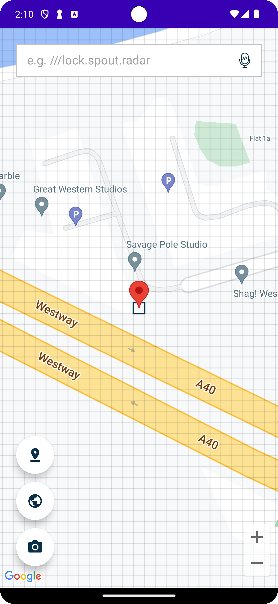

# &nbsp; Multi Components Sample 

Multi Components Sample is a sample demonstration using combining the components of the what3words library such as autosuggest textfield, map, ocr, built with compose and kotlin. The goal of the sample is to showcase how to use whole components in a real case.




## Configuration

AndroidManifest.xml
```xml
<manifest xmlns:android="http://schemas.android.com/apk/res/android">

    <uses-permission android:name="android.permission.INTERNET" />
    <uses-permission android:name="android.permission.RECORD_AUDIO" />
```

build.gradle (app level)
```gradle
dependencies {
   // W3W API Map Lib
    implementation "com.what3words:w3w-android-map-components:$what3words_android_map_components_version"

    // W3W Component Lib
    implementation "com.what3words:w3w-android-components:$what3words_android_components_version"

    // W3W OCR Lib
    implementation "com.what3words:w3w-android-ocr-components:$what3words_android_ocr_components_version"
}
```

For compose, map and mlkit 
```
// Compose
implementation platform('androidx.compose:compose-bom:2023.06.01')
implementation 'androidx.compose.ui:ui'
implementation 'androidx.compose.ui:ui-graphics'
implementation 'androidx.compose.ui:ui-tooling-preview'
implementation "androidx.compose.ui:ui-viewbinding"
implementation "androidx.compose.material:material"
implementation "androidx.activity:activity-compose"
implementation "androidx.constraintlayout:constraintlayout-compose:$compose_constraint_layout_version"

implementation "androidx.core:core-ktx:$androidx_core_version"
implementation "androidx.appcompat:appcompat:$androidx_appcompat_version"
implementation "com.google.android.material:material:$google_material_version"
implementation "androidx.lifecycle:lifecycle-runtime-ktx:$androidx_lifecycle_runtime_ktx_version"
implementation "androidx.fragment:fragment:$fragment_version"
implementation "androidx.fragment:fragment-ktx:$fragment_version"
implementation "androidx.constraintlayout:constraintlayout-compose:$compose_constraint_layout_version"

// Google Map
implementation "com.google.android.gms:play-services-location:$google_play_location_services_version"
implementation "com.google.maps.android:android-maps-utils:$google_map_utils_version"
implementation "com.google.android.gms:play-services-maps:$google_play_maps_services_version"
implementation "com.google.maps.android:maps-compose:$map_compose_version"

//Map box
implementation "com.mapbox.maps:android:$map_box_version"

// mlkit
implementation "com.google.android.gms:play-services-mlkit-text-recognition:$mlkit_core_version"
implementation "com.google.android.gms:play-services-mlkit-text-recognition-chinese:$mlkit_languages_version"
implementation "com.google.android.gms:play-services-mlkit-text-recognition-devanagari:$mlkit_languages_version"
implementation "com.google.android.gms:play-services-mlkit-text-recognition-japanese:$mlkit_languages_version"
implementation "com.google.android.gms:play-services-mlkit-text-recognition-korean:$mlkit_languages_version"
```

For ui testing, intergrate with Cucumber framework
```
//Cucumber
androidTestImplementation "io.cucumber:cucumber-android:$cucumber_android_version"
androidTestImplementation "io.cucumber:cucumber-picocontainer:$cucumber_picocontainer_version"

// Testing
testImplementation 'junit:junit:4.13.2'
androidTestImplementation 'androidx.test.ext:junit:1.1.5'
androidTestImplementation 'androidx.test.espresso:espresso-core:3.5.1'
androidTestImplementation "androidx.test:rules:$test_rule_version"
androidTestImplementation "androidx.test.uiautomator:uiautomator:$uiautomator_version"
androidTestImplementation "androidx.test:core:$test_core_version"
androidTestImplementation "com.android.support:support-annotations:28.0.0"
androidTestImplementation 'com.android.support.test:runner:1.0.2'
androidTestImplementation "androidx.compose.ui:ui-test-junit4:$ui_test_junit4_version"
debugImplementation "androidx.compose.ui:ui-tooling:$ui_tooling_version"
debugImplementation "androidx.compose.ui:ui-test-manifest:$ui_test_manifest_version"
implementation 'androidx.test.espresso:espresso-contrib:3.5.1'
```


# Features

The app shows the main screen with a map with the what3words map component to display the location in 3wa. Besides that the integration with the autosuggest text field with voice and the OCR component for searching three words. 

Additionally, the user can add the marker for the selected square and change the map type between the Google Map and Map box by the floating buttons.

 


MainAppScreen.kt

Create the main app composable contains the three composables: map view, autosuggest text field, the ocr view and the floating buttons on the left for configuration, trigger the ocr search.

```
@Composable
fun MainAppScreen(
    wrapper: What3WordsV3,
    ocrWrapper: W3WOcrWrapper,
    isGoogleMapType: Boolean,
    dataProvider: What3WordsAndroidWrapper,
    voiceProvider: VoiceProvider,
    selectedSuggestion: SuggestionWithCoordinates?,
    onSuggestionChanged: (SuggestionWithCoordinates?) -> (Unit)
) {
    ...
     W3WMultiComponentTheme {
        // A surface container using the 'background' color from the theme
        Surface(
            modifier = Modifier.fillMaxSize(),
            color = MaterialTheme.colors.background
        ) {

            ConstraintLayout(
                modifier = Modifier
                    .fillMaxSize()
                    .statusBarsPadding()
                    .fillMaxSize()
            ) {
                val (w3wTextFieldRef, mapRef, ocrRef, mapTypeRef, addMarkerRef) = createRefs()

                OcrView(
                    ocrWrapper,
                    dataProvider,
                    scanScreenVisible = scanScreenVisible,
                    onScanScreenVisibleChange = { scanScreenVisible = it },
                    onSuggestionScanned = onSuggestionChanged
                )

                MapWrapperView(
                    wrapper,
                    modifier = Modifier.constrainAs(ref = mapRef) {
                        linkTo(start = parent.start, end = parent.end)
                        top.linkTo(anchor = parent.top)
                        bottom.linkTo(anchor = parent.bottom)
                        width = Dimension.fillToConstraints
                        height = Dimension.fillToConstraints
                    },
                    isGGMap = isGGMap,
                    suggestion = selectedSuggestion,
                    onMapClicked = { onSuggestionChanged(w3wMapsWrapper?.getSelectedMarker()) },
                    onWrapperInitialized = { w3wMapsWrapper = it }
                )

                AutoTextField(modifier = Modifier
                    .constrainAs(ref = w3wTextFieldRef) {
                        linkTo(start = parent.start, end = parent.end)
                        top.linkTo(anchor = parent.top)
                        width = Dimension.fillToConstraints
                        height = Dimension.wrapContent
                    }, selectedSuggestion, onItemSelected = onSuggestionChanged,
                    voiceProvider = voiceProvider
                )

                FloatingActionButton(
                    modifier = Modifier
                        .constrainAs(ref = addMarkerRef) {
                            start.linkTo(parent.start)
                            bottom.linkTo(anchor = mapTypeRef.top)
                            width = Dimension.wrapContent
                            height = Dimension.wrapContent
                        }
                        .padding(bottom = 12.dp, start = 24.dp),
                    onClick = {
                        w3wMapsWrapper?.getSelectedMarker()?.let { location ->
                            w3wMapsWrapper?.findMarkerByCoordinates(
                                location.coordinates.lat,
                                location.coordinates.lng,
                            )?.let {
                                w3wMapsWrapper?.removeMarkerAtCoordinates(
                                    location.coordinates.lat,
                                    location.coordinates.lng
                                )
                            } ?: run {
                                w3wMapsWrapper?.addMarkerAtCoordinates(
                                    location.coordinates.lat,
                                    location.coordinates.lng,
                                    W3WMarkerColor.RED
                                )
                            }
                        }
                    },
                    backgroundColor = W3WTheme.colors.background,
                    contentColor = W3WTheme.colors.primary
                ) {
                    Icon(painterResource(R.drawable.icon_pin_drop), "Add Marker")
                }

                FloatingActionButton(
                    modifier = Modifier.testTag("mapTypeButton")
                        .constrainAs(ref = mapTypeRef) {
                            start.linkTo(parent.start)
                            bottom.linkTo(anchor = ocrRef.top)
                            width = Dimension.wrapContent
                            height = Dimension.wrapContent
                        }
                        .padding(bottom = 12.dp, start = 24.dp),
                    onClick = {
                        isGGMap = !isGGMap
                    },
                    backgroundColor = W3WTheme.colors.background,
                    contentColor = W3WTheme.colors.primary
                ) {
                    Icon(painterResource(R.drawable.icon_map), "Map Type")
                }

                FloatingActionButton(
                    modifier = Modifier.testTag("ocrButton")
                        .constrainAs(ref = ocrRef) {
                            start.linkTo(parent.start)
                            bottom.linkTo(anchor = parent.bottom)
                            width = Dimension.wrapContent
                            height = Dimension.wrapContent
                        }
                        .padding(bottom = 32.dp, start = 24.dp),
                    onClick = {
                        scanScreenVisible = true
                    },
                    backgroundColor = W3WTheme.colors.background,
                    contentColor = W3WTheme.colors.primary
                ) {
                    Icon(painterResource(R.drawable.icon_camera), "OCR Button")
                }
            }
        }
    }
    ...
```

## Autosuggest View

 

AutoSuggestionView.kt

Create the AutoTextField composable intergate with W3WAutoSuggestTextField

```
@Composable
fun AutoTextField(
    modifier: Modifier,
    suggestion: SuggestionWithCoordinates?,
    onItemSelected: (SuggestionWithCoordinates?) -> Unit,
    voiceProvider: VoiceProvider
) {
    val TAG = "AutoTextFieldView"
    ...
    W3WAutoSuggestTextField(
            modifier = modifier.padding(bottom = 12.dp),
            ref = ref,
            state = w3wTextFieldState,
            configuration = AutoSuggestConfiguration.Api(apiKey = BuildConfig.W3W_API_KEY, voiceProvider = voiceProvider),
            suggestionPicker = null,
            correctionPicker = null,
            invalidAddressMessageView = null,
            errorView = null,
            onSuggestionWithCoordinates = {
                if (it != null) {
                    Log.d(TAG, "W3WAutoSuggestTextField ${it.words}")
                    onItemSelected(it)
                } else {
                    onItemSelected(null)
                }
            },
            themes = W3WAutoSuggestTextFieldDefaults.themes(
                autoSuggestEditTextTheme = R.style.W3WAutoSuggestEditTextDayNightTheme,
                autoSuggestPickerTheme = R.style.W3WAutoSuggestPickerDayNight,
                autoSuggestErrorMessageTheme = R.style.W3WAutoSuggestErrorMessageDayNight,
                autoSuggestInvalidAddressMessageTheme = R.style.W3WAutoSuggestErrorMessageDayNight
            )
        )
```

## Map View


MapWrapperView.kt

Setup the GoogleMapView and MapBoxView composable integrate with the what3words map component which handles detection on the map to show the selected coordinate by square and populate the selected 3wa from the autosuggest text field or the OCR search to map.

```
@Composable
fun MapWrapperView(
    wrapper: What3WordsV3,
    modifier: Modifier,
    isGGMap: Boolean,
    suggestion: SuggestionWithCoordinates?,
    onMapClicked: () -> (Unit),
    onWrapperInitialized: (W3WMapWrapper) -> (Unit)
) {
    if (isGGMap) {
        GoogleMapView(
            wrapper,
            modifier = modifier,
            suggestion = suggestion,
            onMapClicked = onMapClicked,
            onWrapperInitialized
        )
    } else {
        MapBoxView(
            wrapper,
            modifier = modifier,
            suggestion = suggestion,
            onMapClicked = onMapClicked,
            onWrapperInitialized
        )
    }
}
```

Setup the GoogleMapView and MapBoxView composable intergrate with the what3words map component which handles detect on map

```
@Composable
private fun GoogleMapView(
    wrapper: What3WordsV3,
    modifier: Modifier,
    suggestion: SuggestionWithCoordinates?,
    onMapClicked: () -> (Unit),
    onWrapperInitialized: (W3WMapWrapper) -> (Unit),
) {
    val TAG = "GoogleMapView"
    val context = LocalContext.current
    val office = LatLng(51.520847, -0.195521)
    val cameraPositionState = rememberCameraPositionState {
        position = CameraPosition.fromLatLngZoom(office, 16f)
    }
    ...
```

GoogleMapView.kt

```
@Composable
private fun GoogleMapView(
    wrapper: What3WordsV3,
    modifier: Modifier,
    suggestion: SuggestionWithCoordinates?,
    onMapClicked: () -> (Unit),
    onWrapperInitialized: (W3WMapWrapper) -> (Unit),
) {
    val TAG = "GoogleMapView"
    val context = LocalContext.current
    val office = LatLng(51.520847, -0.195521)
    val cameraPositionState = rememberCameraPositionState {
        position = CameraPosition.fromLatLngZoom(office, 16f)
    }
...
```

MapBoxView.kt

```
@Composable
fun MapBoxView(
    wrapper: What3WordsV3,
    modifier: Modifier,
    suggestion: SuggestionWithCoordinates?,
    onMapClicked: () -> (Unit),
    onWrapperInitialized: (W3WMapWrapper) -> (Unit),
) {
    val TAG = "MapBoxView"
    var w3wMapsWrapper: W3WMapBoxWrapper? by remember {
        mutableStateOf(null)
    }
...
```

## OCR View


OcrView.kt 

Create the OcrView composable containing W3WOcrScanner for scanning the 3 words and using AnimatedVisibility to create an animation showing while clicking the OCR floating button

```
@Composable
fun OcrView(
    ocrWrapper: W3WOcrWrapper,
    dataProvider: What3WordsAndroidWrapper,
    scanScreenVisible: Boolean, onScanScreenVisibleChange: (Boolean) -> Unit,
    onSuggestionScanned: (SuggestionWithCoordinates) -> (Unit)
) {
    val options = remember {
        AutosuggestOptions().apply {
            focus = Coordinates(51.520847, -0.195521)
        }
    }

    AnimatedVisibility(
        visible = scanScreenVisible,
        modifier = Modifier.zIndex(Float.MAX_VALUE),
        enter = expandVertically(
            animationSpec = tween(
                750
            ),
        ),
        exit = shrinkVertically(
            animationSpec = tween(
                750
            )
        )
    ) {
        W3WOcrScanner(
            ocrWrapper,
            dataProvider = dataProvider,
            options = options,
            returnCoordinates = true,
            //optional if you want to override any string of the scanner composable, to allow localisation and accessibility.
            scannerStrings = W3WOcrScannerDefaults.defaultStrings(
                scanStateFoundTitle = stringResource(id = R.string.scan_state_found),
            ),
...
```

## Testing

Additionally, we also created a simple demonstration for writing UI testing for our components by using the Cucumber library to apply Gherkin Syntax and the BDD testing framework.


For more details please check this folder **[test](src/androidTest/java/com/what3words/samples/multiple/test)** contains the setup and writing of the UI testing code by step and using it in the test case (feature) in the folder **[features](src/androidTest/assets/features/)** 

## References

| Name | Repository |
|---|----|
|w3w-android-components|https://github.com/what3words/w3w-android-components
|w3w-android-map-components|https://github.com/what3words/w3w-android-map-components
|w3w-android-ocr-components|https://github.com/what3words/w3w-android-ocr-components
|Cucumber Android|https://github.com/cucumber/cucumber-android