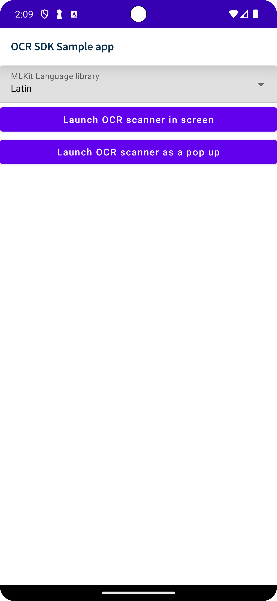

# &nbsp; OCR Sample 

OCR Sample is a sample demonstration using W3WOcrScanner, built with Compose. The goal of the sample is to showcase the current library support.

 For more detailing information about the library please refer the [what3words ocr components](https://github.com/what3words/w3w-android-ocr-components) repository. 

 
 

## Configuration

Before implementing our MLKit OCR Component, you must add the MLKit libraries to our app. To do that, please follow this [MLKit Android setup steps](https://developers.google.com/ml-kit/vision/text-recognition/v2/android#before_you_begin).

AndroidManifest.xml
```xml
<manifest xmlns:android="http://schemas.android.com/apk/res/android"
    xmlns:tools="http://schemas.android.com/tools">

    <uses-feature android:name="android.hardware.camera.any" />

    <uses-permission android:name="android.permission.CAMERA" />
    <uses-permission android:name="android.permission.INTERNET" />
```

build.gradle (app level)
```gradle
dependencies {
        // W3W API OCR Lib
    implementation "com.what3words:w3w-android-ocr-components:$what3words_android_ocr_components_version"

        // mlkit
    implementation "com.google.android.gms:play-services-mlkit-text-recognition:$mlkit_core_version"
    implementation "com.google.android.gms:play-services-mlkit-text-recognition-chinese:$mlkit_languages_version"
    implementation "com.google.android.gms:play-services-mlkit-text-recognition-devanagari:$mlkit_languages_version"
    implementation "com.google.android.gms:play-services-mlkit-text-recognition-japanese:$mlkit_languages_version"
    implementation "com.google.android.gms:play-services-mlkit-text-recognition-korean:$mlkit_languages_version"
}
```

# Features

There are two ways to use our MLKit OCR Component:

As an Activity, MLKitOcrScanActivity, that should be used as an activity for result, which have minimum setup but doesn't allow style customisation. Our library handles all lifecycle and scan flow and will return the selected scanned three word address. Custom localisation and accessibility are available.

Using our Jetpack Compose Composable W3WOcrScanner, will allow all the above, but the results are returned as a callback (selection and errors) and will enable styling customisation, allowing to override all styles used on our composable with just a couple of extra steps to setup.

## Initialization

Initialize OCR wrapper by MLKit Language

```
private lateinit var ocrWrapper: W3WOcrWrapper
private val dataProvider: What3WordsAndroidWrapper by lazy {
    What3WordsV3(
        BuildConfig.W3W_API_KEY,
        this@ComposeOcrScanPopupSampleActivity
    )
}
```

```
private fun getOcrWrapper(): W3WOcrWrapper {
    return W3WOcrMLKitWrapper(
        this,
        viewModel.selectedMLKitLibrary
    )
}
```

Create drop box to select languge for detection

```
 @OptIn(ExperimentalMaterialApi::class)
    @Composable
    fun MLKitLibrariesDropdownMenuBox() {
        var expanded by remember { mutableStateOf(false) }

        Box(
            modifier = Modifier.fillMaxWidth()
        ) {
            ExposedDropdownMenuBox(expanded = expanded, onExpandedChange = {
                expanded = !expanded
            }) {
                CompositionLocalProvider(
                    LocalTextInputService provides null
                ) {
                    TextField(
                        modifier = Modifier.fillMaxWidth(),
                        label = {
                            Text("MLKit Language library")
                        },
                        value = viewModel.getLibName(viewModel.selectedMLKitLibrary),
                        onValueChange = {
                        },
                        readOnly = true,
                        trailingIcon = { ExposedDropdownMenuDefaults.TrailingIcon(expanded = expanded) },
                    )
                }

                ExposedDropdownMenu(expanded = expanded, onDismissRequest = { expanded = false }) {
                    viewModel.availableMLKitLanguages.forEach { item ->
                        DropdownMenuItem(onClick = {
                            viewModel.selectedMLKitLibrary = item
                            expanded = false
                        }) {
                            Text(text = viewModel.getLibName(item))
                        }
                    }
                }
            }
        }
    }
```

## Launch OCR scanner in screen using W3WOcrScanner Composable 

ComposeOcrScanPopupSampleActivity

```
@SuppressLint("UnsafeOptInUsageError")
    override fun onCreate(savedInstanceState: Bundle?) {
        super.onCreate(savedInstanceState)

        setContent {
            W3WTheme {
                // A surface container using the 'background' color from the theme
                NavigationBarScaffold(
                    title = "OCR SDK Sample app"
                ) {
                    var scanScreenVisible by remember { mutableStateOf(false) }
                    val options = remember {
                        AutosuggestOptions().apply {
                            focus = Coordinates(51.2, 1.2)
                        }
                    }

                    LaunchedEffect(key1 = viewModel.selectedMLKitLibrary, block = {
                        ocrWrapper = getOcrWrapper()
                    })

                    AnimatedVisibility(
                        visible = scanScreenVisible,
                        modifier = Modifier.zIndex(Float.MAX_VALUE),
                        enter = expandVertically(
                            animationSpec = tween(
                                750
                            ),
                        ),
                        exit = shrinkVertically(
                            animationSpec = tween(
                                750
                            )
                        )
                    ) {
                        W3WOcrScanner(
                            ocrWrapper,
                            dataProvider = dataProvider,
                            options = options,
                            returnCoordinates = true,
                            //optional if you want to override any string of the scanner composable, to allow localisation and accessibility.
                            scannerStrings = W3WOcrScannerDefaults.defaultStrings(
                                scanStateFoundTitle = stringResource(id = R.string.scan_state_found),
                            ),
                            ...
                    }
                    MLKitLibrariesDropdownMenuBox()
                    Button(modifier = Modifier.fillMaxWidth(), onClick = {
                        scanScreenVisible = true
                    }) {
                        Text(text = "Launch OCR scanner in screen")
                    }
```

## Launch OCR scanner as a pop up using MLKitOcrScanActivity 

ComposeOcrScanPopupSampleActivity

Setup button to launch MLKitOcrScanActivity

```
Button(modifier = Modifier.fillMaxWidth(), onClick = {
    val intent = MLKitOcrScanActivity.newInstanceWithApi(
        this,
        viewModel.selectedMLKitLibrary,
        BuildConfig.W3W_API_KEY,
        options,
        true,
        scanStateFoundTitle = getString(R.string.scan_state_found)
    )
    try {
        resultLauncher.launch(intent)
    } catch (e: ExceptionInInitializerError) {
        viewModel.results = e.message
    }
}) {
    Text(text = "Launch OCR scanner as a pop up")
}
```

Register to receving the result

```
private val resultLauncher =
    registerForActivityResult(ActivityResultContracts.StartActivityForResult()) { result ->
        when {
            //registerForActivityResult success with result
            result.resultCode == Activity.RESULT_OK && result.data?.hasExtra(BaseOcrScanActivity.SUCCESS_RESULT_ID) == true -> {
                val suggestion =
                    result.data!!.serializable<SuggestionWithCoordinates>(BaseOcrScanActivity.SUCCESS_RESULT_ID)
                if (suggestion != null) viewModel.results =
                    ("${suggestion.words}, ${suggestion.nearestPlace}, ${suggestion.country}\n${suggestion.coordinates?.lat}, ${suggestion.coordinates?.lng}")
            }
            //registerForActivityResult canceled with error
            result.resultCode == Activity.RESULT_CANCELED && result.data?.hasExtra(
                BaseOcrScanActivity.ERROR_RESULT_ID
            ) == true -> {
                val error =
                    result.data!!.getStringExtra(BaseOcrScanActivity.ERROR_RESULT_ID)
                viewModel.results = error
            }
            //registerForActivityResult canceled by user.
            else -> {
            }
        }
    }
```