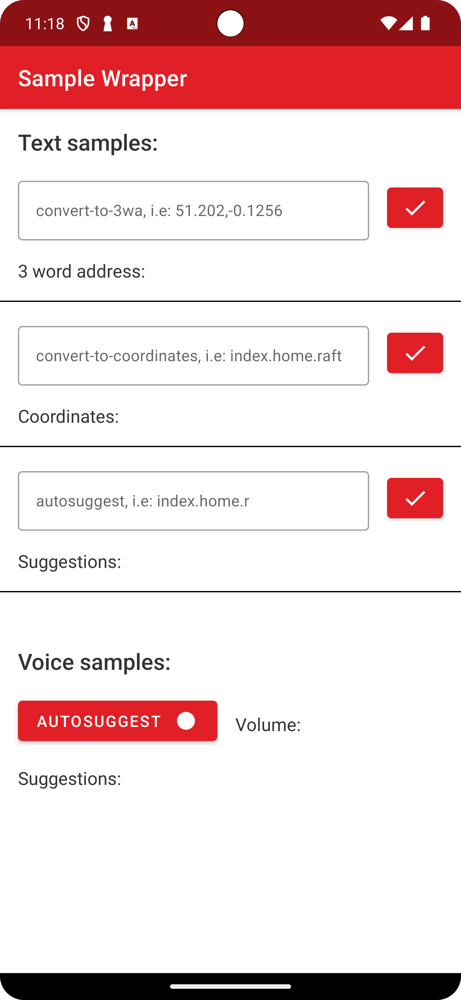

# &nbsp; API Wrapper Sample 

API Wrapper Sample is a sample demonstration using Wrapper API, built with Kotlin and Java. The goal of the sample is to showcase the current library support.

 For more detailing information about the library please refer the [what3words wrapper library](https://github.com/what3words/w3w-android-wrapper) repository. 


 

## Configuration

AndroidManifest.xml
```xml
<manifest xmlns:android="http://schemas.android.com/apk/res/android"
    package="com.yourpackage.yourapp">

    <uses-permission android:name="android.permission.INTERNET" />

    <!-- add if using voice api autosuggest -->
    <uses-permission android:name="android.permission.RECORD_AUDIO" />
```

build.gradle (app level)
```gradle
android {
    ...
    compileOptions {
        sourceCompatibility JavaVersion.VERSION_1_8
        targetCompatibility JavaVersion.VERSION_1_8
    }
}

dependencies {
    ...
    // we are going to use coroutines for kotlin examples, feel free to use any other library of your choice.
    implementation "org.jetbrains.kotlinx:kotlinx-coroutines-core:$kotlinx_coroutines_version"
    runtimeOnly "org.jetbrains.kotlinx:kotlinx-coroutines-android:$kotlinx_coroutines_version"

    // we are going to use rxjava for java examples, feel free to use any other library of your choice.
    implementation "io.reactivex.rxjava3:rxjava:$rxjava3_version"
    implementation "io.reactivex.rxjava3:rxandroid:$rxjava3_android_version"
}
```

# Features

## convertTo3wa


### convertTo3wa example in kotlin with Coroutines.

Because it is not possible to perform a networking operation on the main application thread, API calls need to be made in a background thread, we used Coroutines in this example. *for more Kotlin examples try our **sample app** in this repo*.

```Kotlin
// convert-to-3wa sample
binding.buttonConvertTo3wa.setOnClickListener {
    val latLong =
        binding.textInputConvertTo3wa.text?.replace("\\s".toRegex(), "")?.split(",")
            ?.filter { it.isNotEmpty() }
    val lat = latLong?.getOrNull(0)?.toDoubleOrNull()
    val long = latLong?.getOrNull(1)?.toDoubleOrNull()
    if (lat != null && long != null) {
        CoroutineScope(Dispatchers.IO).launch {
            // use wrapper.convertTo3wa() with Dispatcher.IO - background thread
            val result = wrapper.convertTo3wa(Coordinates(lat, long)).execute()
            CoroutineScope(Dispatchers.Main).launch {
                // use Dispatcher.Main to update your views with the results - Main thread
                if (result.isSuccessful) {
                    binding.resultConvertTo3wa.text = "3 word address: ${result.words}"
                } else {
                    binding.resultConvertTo3wa.text = result.error.message
                }
            }
        }
    } else {
        binding.resultConvertTo3wa.text = "invalid lat,long"
    }
}
```

### convertTo3wa example in Java with RxJava
Because it is not possible to perform a networking operation on the main application thread, API calls need to be made in a background thread, we used RxJava in this example. *for more Java examples try our **sample-java app** in this repo*

```Java
//convert-to-3wa sample
buttonConvertTo3wa.setOnClickListener(view -> {
    try {
        String[] latLong = textInputConvertTo3wa.getText().toString().replaceAll("\\s", "").split(",");
        Double lat = Double.parseDouble(latLong[0]);
        Double lng = Double.parseDouble(latLong[1]);
        if (lat != null && lng != null) {
            Observable.fromCallable(() -> wrapper.convertTo3wa(new Coordinates(lat, lng)).execute())
                    .subscribeOn(Schedulers.io())
                    .observeOn(AndroidSchedulers.mainThread())
                    .subscribe(result -> {
                        if (result.isSuccessful()) {
                            resultConvertTo3wa.setText(String.format("3 word address: %s", result.getWords()));
                        } else {
                            resultConvertTo3wa.setText(result.getError().getMessage());
                        }
                    });
        } else {
            resultConvertTo3wa.setText("invalid lat,long");
        }
    } catch (Exception e) {
        resultConvertTo3wa.setText("invalid lat,long");
    }
});
```

<br></br>
## voice autosuggest example in Kotlin
```Kotlin
// text autosuggest sample
binding.buttonAutoSuggest.setOnClickListener {
    CoroutineScope(Dispatchers.IO).launch {
        // use wrapper.autosuggest() with Dispatcher.IO - background thread
        val result =
            wrapper.autosuggest(binding.textInputAutoSuggest.text.toString()).execute()
        CoroutineScope(Dispatchers.Main).launch {
            // use Dispatcher.Main to update your views with the results - Main thread
            if (result.isSuccessful) {
                binding.resultAutoSuggest.text = if (result.suggestions.count() != 0)
                    "Suggestions: ${result.suggestions.joinToString { it.words }}"
                else "No suggestions available"
            } else {
                binding.resultAutoSuggest.text = result.error.message
            }
        }
    }
}
```
<br></br>
## For a full working example with voice and AUDIO_RECORD permission request check our [MainActivity](src/main/java/com/what3words/samples/wrapper/MainActivity.kt/) and [MainActivityJava](src/main/java/com/what3words/samples/wrapper/MainActivityJava.java/)

### Testing it by switch the launcher Activity in the Manifest file
```
<activity
    android:name="com.what3words.samples.wrapper.presentation.kotlin.MainActivity"
    android:exported="true">
    <intent-filter>
        <action android:name="android.intent.action.MAIN" />

        <category android:name="android.intent.category.LAUNCHER" />
    </intent-filter>
</activity>

<!-- Change the launcher while testing java-->
<!--        <activity android:exported="true" android:name=".MainActivityJava">-->
<!--            <intent-filter>-->
<!--                <action android:name="android.intent.action.MAIN" />-->

<!--                <category android:name="android.intent.category.LAUNCHER" />-->
<!--            </intent-filter>-->
<!--        </activity>-->
```
